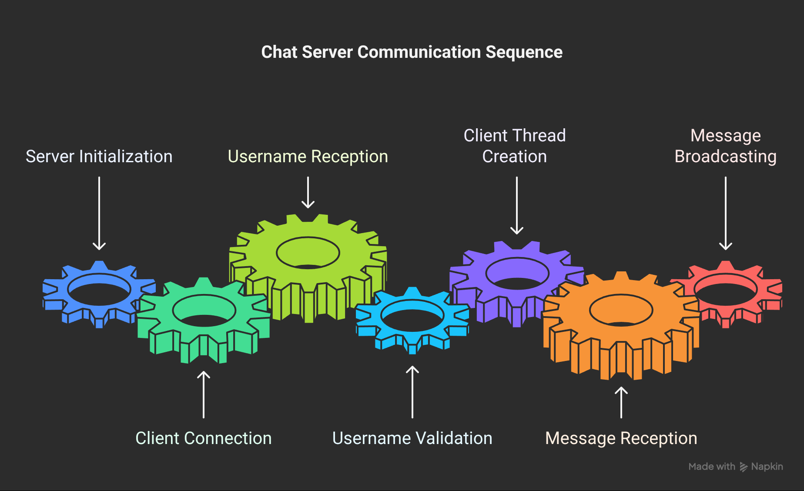

# Chat-Application

A simple real-time chat application built with Python using the `socket` module for backend communication and (optionally) `Flask` for the web interface.

## Features

- Real-time messaging between multiple users
- Command-line client for chat
- Easy to set up and run locally
- Uses Python's standard `socket` module for networking

## Communication Sequence

To help you understand how the chat server works, here’s a visual overview of the communication sequence:



## Requirements

- Python 3.x

## Installation

1. Clone the repository:
    ```sh
    git clone https://github.com/yourusername/Chat-Application.git
    cd Chat-Application
    ```

2. (Optional) Install Flask if you plan to use a web interface later:
    ```sh
    pip install Flask
    ```

## Usage

### 1. Find a Free Port (Optional)

If you want to use a different port, you can run the provided script to find a free port:
```sh
python to_find_a_free_port.py
```
Update the `PORT` variable in both `server.py` and `clinet.py` if you change the port.

### 2. Start the Chat Server

```sh
python server.py
```

### 3. Start the Client(s)

Open a new terminal for each client and run:
```sh
python clinet.py
```
Make sure the `HOST` and `PORT` in `clinet.py` match those in `server.py`.

### 4. Chat!

Each client will connect to the server and can send/receive messages in real time.

## Project Structure

```
Chat-Application/
├── server.py                  # Chat server using sockets
├── clinet.py                  # Command-line chat client
├── to_find_a_free_port.py     # Utility to find a free port
├── static/                    # (For future Flask web interface)
├── templates/                 # (For future Flask web interface)
├── chat_server_communication_sequence.png  # Communication sequence diagram
└── README.md
```

## Notes

- The server listens on `127.0.0.1` (localhost), so only clients on the same machine can connect.
- You can extend this project by adding a Flask web interface in the future.

## License

This project is licensed under the MIT License.